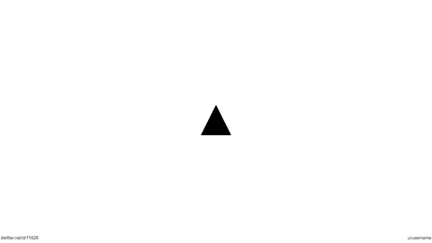
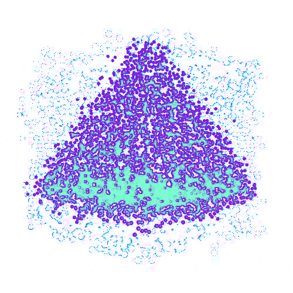

<h1>meanOs</h1>

<i>The smallest and the most powerful operating system.</i>

The first decentralized, artificially intelligent, MEAN.js stack, operating system. meanOs is the only operating system hosted anonymous using a P2P network and a suite of non-standard in-browser delivery mechanisms such as - [Gun](https://gun.eco) and - [IPFS](https://ipfs.io/)

meanOs is specifically designed to work with Brave but is compatible with all other major browsers. meanOs is Proud to be a BRAVE supporter!

 <table width="100%">
 <tr>
 <td></td><td></td><td></td><td> </td><td></td><td></td><td></td>
 </tr>
 <tr>
 <td>Latest ✔</td><td>Latest ✔</td><td>Latest ✔</td><td>Latest ✔</td><td>Latest ✔</td><td>Latest ✔</td><td>Latest ✔</td>
 </tr>
 </table>

 

 

## Content Summery

- [GUI Options](#gui-options)
- [Architecture](#architecture)
- [Related Developments](#related-developments)
- [Acknowledgements](#acknowledgements)
- [meanOs (Operating System)](https://github.com/obeyi/meanOs/tree/master/ext)
- [meanOs (Server)](https://github.com/obeyi/meanOs/tree/master/server)
- [meanOs (Player)](https://github.com/obeyi/meanOs/tree/master/player)
- [meanOs (Theme)](https://github.com/obeyi/meanOs/tree/master/theme)

 ## GUI Options:

- [x] Google Fuchsia, Fuchsia is an open-source capability-based operating system currently being developed by Google. It first became known to the public when the project appeared on a self hosted form of git in August 2016 without any official announcement.

- [x] Kali Linux, Kali Linux is a Debian-derived Linux distribution designed for digital forensics and penetration testing. It is maintained and funded by Offensive Security.

- [x] macOS, macOS is a series of proprietary graphical operating systems developed and marketed by Apple Inc. since 2001. It is the primary operating system for Apple's Mac computers. Within the market of desktop, laptop and home computers, and by web usage, it is the second most widely used desktop OS, after Microsoft Windows.

 ## Architecture

A - [ServiceWorker](https://developer.mozilla.org/en-US/docs/Web/API/Service_Worker_API) is used as a way to persist the censorship circumvention library after the initial visit to the participating website.

Service workers essentially act as proxy servers that sit between web applications, the browser, and the network (when available). They are intended, among other things, to enable the creation of effective offline experiences, intercept network requests and take appropriate action based on whether the network is available, and update assets residing on the server. They will also allow access to push notifications and background sync APIs.

After the ServiceWorker is downloaded and activated, it handles all `fetch()` events by first trying to use the regular HTTPS request to the original website. If that fails (for whatever reason, be it timeout, or a `4xx`/`5xx` error), the plugins kick-in, attempting to fetch the content via any means are available.

A service worker is an event-driven worker registered against an origin and a path. It takes the form of a JavaScript file that can control the web-page/site that it is associated with, intercepting and modifying navigation and resource requests, and caching resources in a very granular fashion to give you complete control over how your app behaves in certain situations (the most obvious one being when the network is not available).

A service worker is run in a worker context: it therefore has no DOM access, and runs on a different thread to the main JavaScript that powers your app, so it is non-blocking. It is designed to be fully async; as a consequence, APIs such as synchronous XHR and localStorage can't be used inside a service worker.

Service workers only run over HTTPS, for security reasons. Having modified network requests, wide open to man in the middle attacks would be really bad. In Firefox, Service Worker APIs are also hidden and cannot be used when the user is in private browsing mode.

 ## Related Developments

- [x] https://ipfs.io/ipfs/QmNhFJjGcMPqpuYfxL62VVB9528NXqDNMFXiqN5bgFYiZ1/its-time-for-the-permanent-web.html

Neocities has collaborated with Protocol Labs to become the first major site to implement IPFS in production. Starting today, all Neocities web sites are available for viewing, archiving, and hosting by any IPFS node in the world. When another IPFS node chooses to host a site from Neocities, that version of the site will continue to be available, even if Neocities shuts down or stops hosting it. The more IPFS nodes seed Neocities sites, the more available (and redundant) Neocities sites become. And the less centrally dependent the sites are on us to continue existing.

- [x] https://blog.archive.org/2015/02/11/locking-the-web-open-a-call-for-a-distributed-web/

Presentation by Brewster Kahle, Internet Archive Digital Librarian at Ford Foundation NetGain gathering, — a call from 5 top foundations to think big about prospects for our digital future.  (More detailed version)

- [x] https://censorship.no/

Designed for accessing websites from the stringest network environments, the censorship.no project (CENO) by eQualit.ie , allows you to browse the Web without restriction, circumventing any network filtering. The underlying architecture offers peer-to-peer routing and distributed caching, using 'darknet' infrastructure to avoid network censorship and bring the Web to your browser.

- [x] https://netblocks.org/

NetBlocks is a civil society group working at the intersection of digital rights, cyber-security and internet governance. Independent and non-partisan, NetBlocks strives for an open and inclusive digital future for all.

- [x] https://samizdat.is/

Samizdat is a browser-based Web censorship circumvention library, easily deployable on any website.

    

 ## Acknowledgements

 
The following projects have been instrumental in the development to the development of meanOs:

 

- [x] Gun: GUN is a data­base en­gine that runs every­where JavaScript does — browsers, mo­bile de­vices and servers, al­low­ing you to build ex­act­ly the data sys­tem you want.

- [x] InterPlanetary File System: The InterPlanetary File System is a protocol and peer-to-peer network for storing and sharing data in a distributed file system. IPFS uses content-addressing to uniquely identify each file in a global namespace connecting all computing devices.

- [x] Web Server Chrome: An HTTP Web Server for Chrome (chrome.sockets API)

- [x] Violentmonkey: Violentmonkey provides userscripts support for browsers. It works on browsers with WebExtensions support.

- [x] Samizdat: A decentralized website, browser-based solution to Internet censorship that requires no additional software for website visitors and minimal configuration for website admins.

- [x] Cloudflare: Cloudflare, Inc. is an American web-infrastructure and website-security company, providing content-delivery-network services, DDoS mitigation, Internet security, and distributed domain-name-server services.

- [x] Fuchsia-web-demo: Pink + Purple + Web == Fuchsia Web Demo - (unofficial). The Fuchsia Web Demo tried to simulate the UI and animations of Fuchsia OS Armadillo. RIP Armadillo. Simple Web Demo that simulates Google's new OS. Works across devices. 

- [x] Mac OS X Lion with CSS3: Mac Os X Lion with CSS3 Experiment by Alessio Atzeni - I wanted to create with only use of CSS3 the boot, the login page and finally the desktop of the Mac OS X Lion. 

- [x] Webix Web Desktop: Web Desktop on top of Webix UI, based on Webix UI widgets.

- [x] Vercel: Vercel is the easiest way to deploy websites. Host your web projects with zero configuration, automatic SSL, and global CDN.

- [x] BrowserStack: BrowserStack is a cloud web and mobile testing platform that enables developers to test their websites and mobile applications across on-demand browsers, operating systems and real mobile devices, without requiring users to install or maintain an internal lab of virtual machines, devices or emulators.

    

